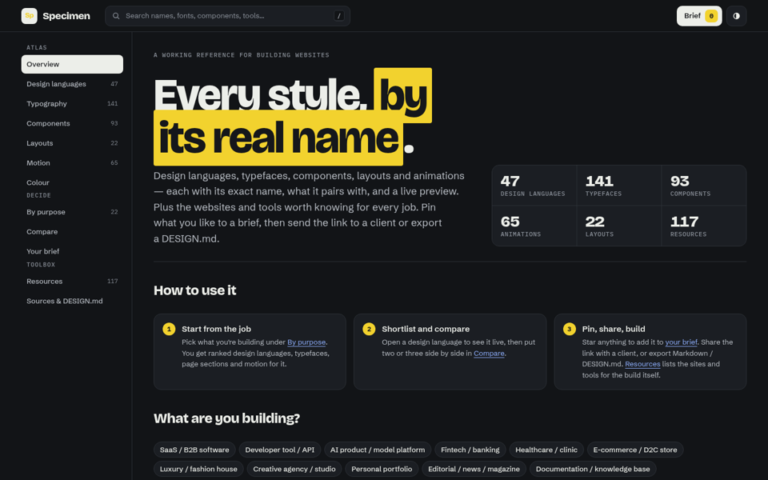
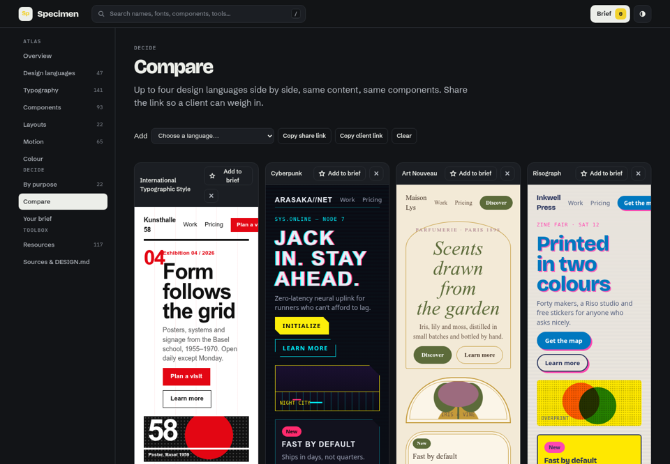
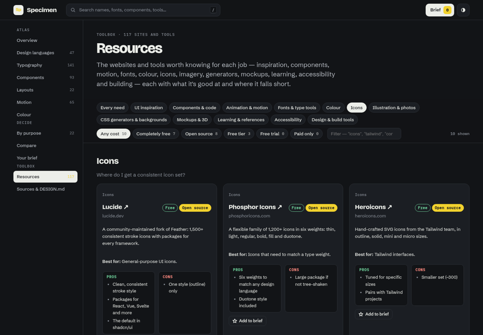

# Specimen Atlas

**Every web design style, by its real name — with live previews, the fonts and components that go with it, and a brief you can send to a client.**

Specimen is a reference for building websites. It names and shows 47 design languages
(Swiss Style, Neo-Brutalism, Glassmorphism, IBM Carbon, Cyberpunk, Wabi-sabi…), then
connects each one to the typefaces, components, layouts, animations and kinds of site it
suits. Clients can star what they like and send you back a single link; you open it and
export a `DESIGN.md` that a coding agent can build from.



## Why

Talking about visual style is hard when nobody shares the vocabulary. "Make it modern"
could mean Swiss, Bento, Linear-style dark UI or Glassmorphism. Specimen gives every
style, typeface, component and animation its **exact, published name**, shows it live,
and makes the connections explicit, so a builder and a client can point at the same thing.

## Features

- **47 design languages.** Each comes with its origin, how to recognise it, principles,
  a named palette, typefaces, shape and elevation, layout, motion, signature components,
  what it's good and bad for, do's and don'ts, accessibility notes, real examples and
  references. Every one renders the same mini landing page, so you compare like with like.
- **Side-by-side compare.** Put up to four languages next to each other and share the link.

  

- **141 typefaces.** Each has its classification, designer, foundry, year, licence and
  variable axes. Commercial faces are flagged and always come with free alternatives. The
  typography section also has classifications (Vox-ATypI), named pairings, modular type
  scales with a live preview, and a glossary.
- **93 components.** The canonical name plus what shadcn/ui, Radix, MUI, Material 3,
  Apple HIG, Fluent 2, Bootstrap and Ant Design call it, with anatomy, states and the
  WAI-ARIA pattern. Re-render the whole library in any design language.
- **65 animations with live demos,** from fade-up reveals to magnetic buttons, SVG morphs
  and particles. Each lists its technique, easing curve by name, duration, libraries and
  reduced-motion advice.
- **Layouts, colour and purposes.** 22 named layouts drawn as wireframes. Colour
  harmonies, rules, colour models and dark-mode strategies. 22 site types (SaaS, fintech,
  restaurant, portfolio…), each with ranked design languages, typefaces and a typical page
  from top to bottom.
- **Resources: 117 websites and tools** for each job, covering UI inspiration, components,
  motion, fonts, colour, icons, imagery, CSS generators, mockups, learning, accessibility
  and design tools. Each has a description, pros, cons and a "best for" line. You can
  filter by need and by cost: completely free, open source, free tier, free trial or paid
  only.

  

- **Client briefs.** Star anything to add it to a brief. The whole brief (picks, notes
  and a "why" for each item) is encoded in its share link, so there's no account and no
  server. A simplified client view (`?client=1`) replaces "Add to brief" with "I like
  this". Export the brief as Markdown or as a `DESIGN.md`.
- **DESIGN.md for every language,** in the [Google Labs DESIGN.md format](https://github.com/google-labs-code/design.md):
  tokens in YAML front matter plus rationale in prose. A brief's export uses your chosen
  language with your chosen fonts.
- **Search everything** with `/` or `Ctrl/⌘ K`.
- **Light and dark themes,** keyboard-accessible, respects `prefers-reduced-motion`,
  works down to phone width.

## Quick start

Requires Node 20 or newer.

```bash
git clone https://github.com/Ujjwal-Gowda/specimen.git
cd specimen
npm install
npm run dev          # http://localhost:5173
```

### Scripts

| Command | What it does |
|---|---|
| `npm run dev` | Dev server with hot reload |
| `npm run build` | Type-check and build the static site into `dist/` |
| `npm run preview` | Serve the production build |
| `npm run typecheck` | TypeScript for the app, tools and tests |
| `npm run lint` | ESLint (typescript-eslint, react-hooks) |
| `npm test` | Vitest: data integrity, brief encoding and export, Compare page |
| `npm run validate` | Readable report of cross-references, token contrast, stylesheets and resources |
| `npm run design-md` | Regenerate `public/design-md/*.md` from the language data |

### Deploy

The live site is deployed on **Netlify** from `main`. `netlify.toml` holds the build
settings (`npm run build` → `dist/`, Node 22), and every pull request gets a preview URL.
`.github/workflows/ci.yml` runs typecheck, lint, tests, the validator and a build on every
push and pull request.

The build is a fully static site with relative asset paths and hash-based routes, so
`dist/` also works on any other static host (Cloudflare Pages, Vercel, GitHub Pages, S3)
and from any sub-path, with no rewrite rules. The only external requests are to Google Fonts.

## How it's built

Vite, React 19, TypeScript and React Router. There's no backend: all content is typed
data in `src/data/`, and all state (brief, compare set, theme) lives in `localStorage`
and in share links.

```
src/
  main.tsx, App.tsx          entry + hash router (one lazy chunk per page)
  types.ts                   data shapes for everything in src/data
  data/                      all content, plain TypeScript with no React
    languages/<id>.ts        one file per design language (+ index.ts sets the order)
    typefaces.ts  components.ts  layouts.ts  animations.ts  purposes.ts
    type-system.ts  color.ts  resources.ts
    index.ts                 collections + typed lookups (get, resolve, KINDS)
  styles/
    app.css                  site chrome
    ui.css, ui-extra.css     the .ui-* preview primitives, drawn from CSS custom properties
    languages/<id>.css       one per language: tokens, signature overrides, image-slot art
  components/                app shell, search palette, previews, tiles, shared UI
  pages/                     one component per route
  state/AtlasContext.tsx     brief, compare, client mode, theme, toasts
  lib/                       brief codec + export, DESIGN.md generator, search, fonts, validation
  demos/                     live animation demos (imperative DOM code behind <DemoStage>)
tools/                       validate.ts, build-design-md.ts
tests/                       Vitest suites
public/design-md/            generated DESIGN.md files
docs/                        SCHEMA.md (data shapes), BRIEF.md, REVIEWS.md
```

### How the previews work

Every design-language preview and every component preview uses the same small set of
`.ui-*` primitives (`.ui-nav`, `.ui-btn`, `.ui-card`, `.ui-media`…). `styles/ui.css`
draws them from CSS custom properties. Each language's stylesheet sets those tokens on
`.lang-<id>` and adds its signature, scoped under that class: hard shadows for
Neo-Brutalism, clipped corners and scanlines for Cyberpunk, overprinted inks for
Risograph, and so on. Swapping one class re-themes the whole preview, which is how the
component library re-renders in any language.

## Contributing

Corrections and additions are welcome, especially wrong names, dates, licences, prices
and dead links.

- **Add or fix content:** edit the right file in `src/data/`. The types in `src/types.ts`
  enforce the shape, and `docs/SCHEMA.md` explains each field.
- **Add a design language:**
  1. Create `src/data/languages/<id>.ts` and add it to `languages/index.ts`.
  2. Create `src/styles/languages/<id>.css` with the tokens on `.lang-<id>`, any signature
     overrides, and a `.lang-<id> .ui-media` rule for the image slot.
  3. Run `npm run design-md`.
- **Add an animation:** add the data to `animations.ts` and a demo to `src/demos/` (each
  demo builds inside an element and returns a cleanup function).
- **Add a resource:** add it to `src/data/resources.ts` with honest pros and cons.
  `pricing` means what it costs to use: `Free` (everything free), `Freemium` (a useful
  free tier), `Free trial` or `Paid`. `openSource` is a separate flag.

Before opening a pull request, run:

```bash
npm run typecheck && npm run lint && npm test && npm run validate
```

`validate` fails on any ID that doesn't resolve, duplicate IDs, a language without a
stylesheet, or a resource missing pros, cons or an https URL. It warns about text or
accent contrast below 4.5:1.

Content rules: use real, published names only; never invent a term. Commercial typefaces
must list a free alternative. Examples must be real, live sites.

## Sources

Names and facts come from primary sources where possible:

- **Platform systems:** [Material Design](https://m3.material.io), [Apple HIG](https://developer.apple.com/design/human-interface-guidelines), [Fluent 2](https://fluent2.microsoft.design) and [IBM Carbon](https://carbondesignsystem.com)
- **Component names and keyboard behaviour:** the [WAI-ARIA Authoring Practices](https://www.w3.org/WAI/ARIA/apg/patterns/)
- **Library documentation:** shadcn/ui, Radix, MUI, Bootstrap and Ant Design
- **Typefaces:** foundry sites, [Google Fonts](https://fonts.google.com) and [Fontshare](https://www.fontshare.com)
- **Aesthetics:** the Consumer Aesthetics Research Institute, and design-history references cited on each language page

Real brands' DESIGN.md files are linked from [awesome-design-md](https://github.com/VoltAgent/awesome-design-md).

Typeface previews load from Google Fonts. Commercial and system faces are shown in a
labelled free stand-in, never the real font. Trademarks and product names belong to their
owners; they appear here only to name and reference them.
